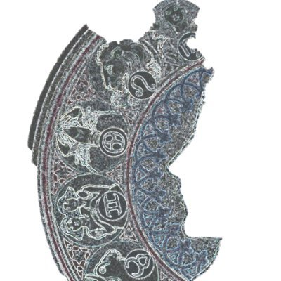

# Hello World! I'm Ea_Gitro!
<link rel="stylesheet" href="./style/style.css">

```
wwO_jk0X$d=.~<<<<c-._____._<<_.~-- (I+<&v!~(+JzSv1
Wwtwkwytw>.(<(<<(~~~.-(<<~<1z~___<<!??ZZvV1<<<+<<~
Zw1Udwkd%.(<(<<<_~:. (<(`_`(C_((!-<_(J<<++1>~~_~~:
O+<71JS%.(<(;<<<<<??1-i ~_`(<<<(_<-.J>(1z-_~_:<_:<
XdXyVGf.~<<<<><<<<<+Iz+z-_<(<_(-<~<j???z>__1((<(<~
SZUA?K!_(<<x>-(J++1z+<(<(<((><?<(<+I.(i?<<./_._~>~
wVTK+P.(<<zOJ6JOV!:<<~<(<_-(+1((11d`__<.(ji_-._<_(
js2(H!_(<1z1-._ <?_~/__<((<<_~1++1{.+_._:vz<--__`
R8WJK ~<((;^?<x+<<_(~((<<<<1<<<>u=``(<<J_-(<(I-<.
Kz26r.(<<1+<?jwS(:<_.(<+?<+-_<jv ``  ``?+1+>(>?&.-
rJbW].(<<>(J1-(7J;((<+><+?1>1d!````````.(:(lj>_j<1
hkSH].(<1>?1(><~:_<<z1><?1+_(lOG_```````<<_1(J(JwX
9dHW].(zzvz<w-/<_<<<_(>1+?z><1Od-. ````._(<(Iwzzv>
wdHW].(c1Oj0>?_~__..(.(<jI+++llzw<!.`....(<~</-+<;
WHWy].jz(1?G&J{_(_.>~:.<z(z7<<+lO\```..._(1<(~<11<
WWHk].jz>Ii0=-__._~___(1?<O+OxzCZ `` ...((~(<_((_<
J7=``.JRI(zZ4w0j-+((<J1?1(c+zz<+w...-__._!<(:((<><
edp `.JHJ+1lJ1++z+<<<<<<?1?1C+wI<+wwwwd~?,___(-<<(
WSfb`.JHR1<z+wz1C<J!(l-.._J(1zzZjyI1(Xf~.?-_>!_+:<
XHKW_.jXWRO?v+&Iiv-``.?`(J'-i?1z?O&+uC__..t`+!(.<<
WXjK`.JqHHmO?ZJOu>_.--._<._.1j1(1jZC-.....1``.`..-
KId^`(dH8UWhO+OC?l_!_(..._.(&?<<vdGt_~.~..,..`.``.
WH<d)_dYkIWWkv+1z++r.._~~~(<<<:J/yV_~.(>...t`.`.``
f(HW)(dAHZXXXHsO+OOd&--(Jvi&(J&S1X>~~(P~...(-`..`.
```


<!--
**EaGitro/EaGitro** is a ✨ _special_ ✨ repository because its `README.md` (this file) appears on your GitHub profile.

Here are some ideas to get you started:

- 🔭 I’m currently working on ...
- 🌱 I’m currently learning ...
- 👯 I’m looking to collaborate on ...
- 🤔 I’m looking for help with ...
- 💬 Ask me about ...
- 📫 How to reach me: ...
- 😄 Pronouns: ...
- ⚡ Fun fact: ...
-->


 &nbsp; 

 &nbsp; 

<!-- <style>
.card {
    position: relative;
    display: flex;
    flex-direction: column;
    min-width: 0;
    word-wrap: break-word;
    background-color: #fff;
    background-clip: border-box;
    border: 1px solid rgba(0,0,0,.125);
    border-radius: 0.25rem;
}

</style> -->


<!-- <div class="card" style="width: 18rem; position: relative; display: flex;    flex-direction: column; min-width: 0; word-wrap: break-word; background-color: #fff;background-clip: border-box; border: 1px solid rgba(0,0,0,.125); border-radius: 0.25rem;">
  


  <div class="card-body">
    <h5 class="card-title">My Twitter</h5>
    <p class="card-text">Here is My Twitter.</p>
    <a href="https://twitter.com/EaGitro" class="btn btn-primary">Go somewhere</a>
  </div>
</div> -->

<div style="width: 18rem; background-color: black;">
    
    <br>
    <h5>My Twitter<h5>
</div>